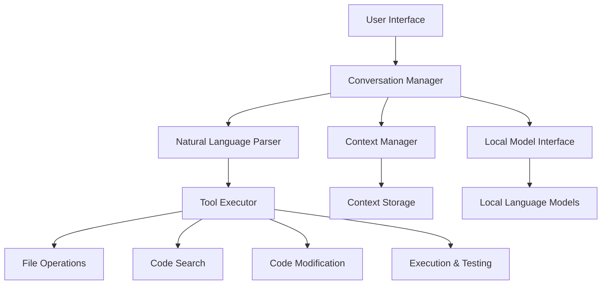

# Design Document

## Overview

Optimal Agent는 로컬 언어 모델을 활용한 코딩 에이전트 시스템으로, 자연어 파싱 기반의 도구 실행과 지능적인 컨텍스트 관리를 통해 프라이버시를 보장하면서 효과적인 코딩 지원을 제공합니다. 시스템은 모듈러 아키텍처를 채택하여 다양한 로컬 모델과 도구들을 유연하게 통합할 수 있도록 설계되었습니다.

## Architecture

### High-Level Architecture



### Core Components

1. **Conversation Manager**: 대화 흐름 제어 및 세션 관리
2. **Local Model Interface**: 다양한 로컬 모델과의 통합 인터페이스
3. **Natural Language Parser**: 자연어 출력에서 도구 호출 의도 추출
4. **Tool Executor**: 파싱된 명령을 실제 도구 실행으로 변환
5. **Context Manager**: 컨텍스트 윈도우 최적화 및 메모리 관리

## Components and Interfaces

### 1. Conversation Manager

**책임**: 전체 대화 세션 관리, 사용자 입력 처리, 응답 생성 조율

```python
class ConversationManager:
    def start_session(self) -> SessionId
    def process_message(self, session_id: SessionId, message: str) -> Response
    def get_conversation_history(self, session_id: SessionId) -> List[Message]
    def end_session(self, session_id: SessionId) -> None
```

**주요 기능**:
- 세션 생명주기 관리
- 메시지 라우팅 및 응답 조합
- 에러 처리 및 복구

### 2. Local Model Interface

**책임**: 다양한 로컬 언어 모델과의 통합 및 추상화

```python
class LocalModelInterface:
    def load_model(self, model_name: str, config: ModelConfig) -> bool
    def generate_response(self, prompt: str, context: Context) -> str
    def get_model_info(self) -> ModelInfo
    def switch_model(self, model_name: str) -> bool
```

**지원 모델**:
- GPT-OSS-20B
- Qwen 시리즈
- Gemma 시리즈
- 기타 HuggingFace 호환 모델

### 3. Natural Language Parser

**책임**: 모델 출력에서 도구 호출 패턴 인식 및 파라미터 추출

```python
class NaturalLanguageParser:
    def parse_tool_calls(self, text: str) -> List[ToolCall]
    def extract_parameters(self, text: str, tool_type: str) -> Dict[str, Any]
    def validate_tool_call(self, tool_call: ToolCall) -> ValidationResult
```

**파싱 패턴**:
```
"I need to read the file at {path}" → read_file(path)
"Let me search for {pattern}" → grep_search(pattern)
"I'll create a file {path} with content: {content}" → write_file(path, content)
"Running command: {cmd}" → run_command(cmd)
```

### 4. Tool Executor

**책임**: 파싱된 도구 호출을 실제 시스템 작업으로 실행

```python
class ToolExecutor:
    def execute_tool(self, tool_call: ToolCall) -> ToolResult
    def register_tool(self, tool: Tool) -> None
    def get_available_tools(self) -> List[str]
```

**도구 카테고리**:
- **File Operations**: read_file, write_file, list_directory, file_tree
- **Code Search**: grep_search, find_definition, find_references, get_file_outline
- **Code Modification**: edit_file, apply_diff, refactor_rename
- **Execution**: run_command, run_tests, get_diagnostics

### 5. Context Manager

**책임**: 컨텍스트 윈도우 최적화 및 중요 정보 보존

```python
class ContextManager:
    def add_message(self, message: Message) -> None
    def get_context(self, max_tokens: int) -> Context
    def compress_context(self, compression_ratio: float) -> None
    def summarize_content(self, content: str) -> str
```

**압축 전략**:
- 최근 메시지 우선 보존
- 중요도 점수 기반 선택
- 파일 내용 요약화
- 작업 상태 정보 유지

## Data Models

### Core Data Structures

```python
@dataclass
class Message:
    id: str
    timestamp: datetime
    role: str  # 'user' | 'assistant' | 'system'
    content: str
    metadata: Dict[str, Any]

@dataclass
class ToolCall:
    tool_name: str
    parameters: Dict[str, Any]
    confidence: float
    source_text: str

@dataclass
class Context:
    messages: List[Message]
    current_files: List[str]
    working_directory: str
    session_state: Dict[str, Any]
    token_count: int

@dataclass
class ToolResult:
    success: bool
    output: str
    error_message: Optional[str]
    execution_time: float
```

### Configuration Models

```python
@dataclass
class ModelConfig:
    model_name: str
    max_tokens: int
    temperature: float
    context_window: int
    prompt_template: str

@dataclass
class SystemConfig:
    default_model: str
    tools_enabled: List[str]
    context_compression_threshold: int
    auto_save_interval: int
```

## Error Handling

### Error Categories

1. **Model Errors**: 모델 로딩 실패, 생성 오류
2. **Parsing Errors**: 도구 호출 파싱 실패
3. **Tool Execution Errors**: 파일 시스템 오류, 명령 실행 실패
4. **Context Errors**: 메모리 부족, 컨텍스트 오버플로우

### Error Recovery Strategies

```python
class ErrorHandler:
    def handle_model_error(self, error: ModelError) -> RecoveryAction
    def handle_parsing_error(self, error: ParsingError) -> RecoveryAction
    def handle_tool_error(self, error: ToolError) -> RecoveryAction
    def suggest_alternatives(self, failed_action: str) -> List[str]
```

**복구 메커니즘**:
- 자동 재시도 (지수 백오프)
- 대체 모델 전환
- 사용자 확인 요청
- 부분 실행 결과 보존

## Testing Strategy

### Unit Testing

- **Component Tests**: 각 모듈의 독립적 기능 검증
- **Parser Tests**: 다양한 자연어 패턴에 대한 파싱 정확도 테스트
- **Tool Tests**: 모든 도구의 정상 동작 및 에러 처리 검증

### Integration Testing

- **End-to-End Tests**: 전체 대화 플로우 시나리오 테스트
- **Model Integration Tests**: 다양한 로컬 모델과의 호환성 검증
- **Context Management Tests**: 컨텍스트 압축 및 복원 정확성 테스트

### Performance Testing

- **Response Time Tests**: 각 도구 실행 시간 측정
- **Memory Usage Tests**: 컨텍스트 관리 효율성 검증
- **Scalability Tests**: 대용량 코드베이스에서의 성능 테스트

### Test Data

```python
# 테스트용 샘플 대화
SAMPLE_CONVERSATIONS = [
    {
        "scenario": "file_exploration",
        "messages": [
            {"role": "user", "content": "Show me the project structure"},
            {"role": "assistant", "content": "I'll explore the directory structure for you"},
        ]
    },
    {
        "scenario": "code_search",
        "messages": [
            {"role": "user", "content": "Find all functions named 'calculate'"},
            {"role": "assistant", "content": "Let me search for calculate functions"},
        ]
    }
]
```

### Validation Framework

- **Output Format Validation**: 모델 출력의 일관성 검증
- **Tool Call Accuracy**: 파싱된 도구 호출의 정확성 측정
- **Context Preservation**: 중요 정보 보존률 측정